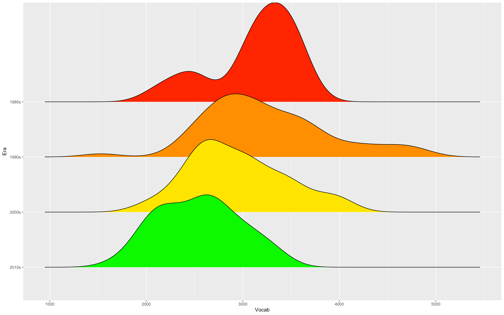
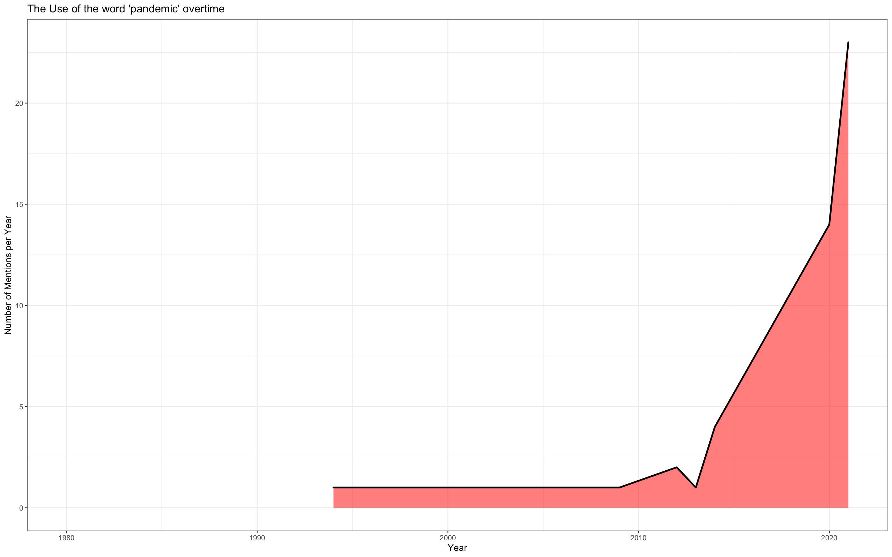
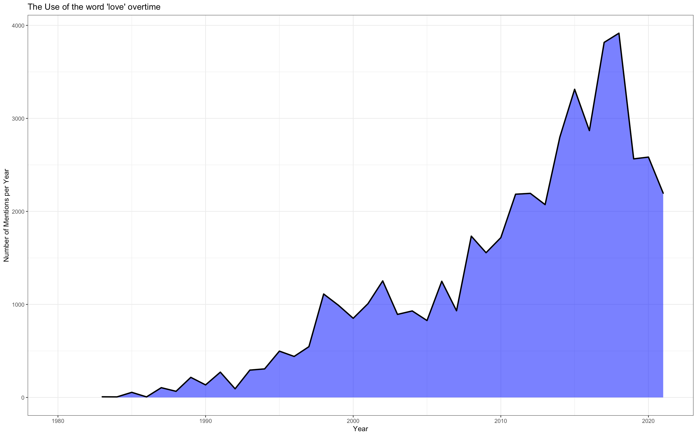
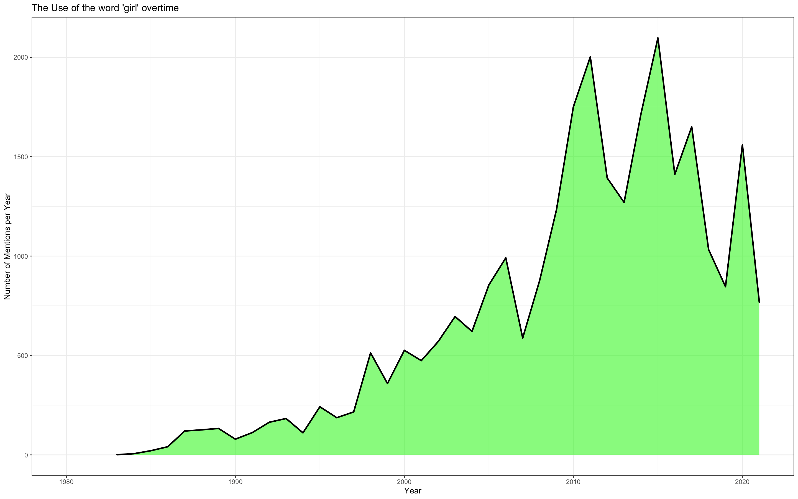
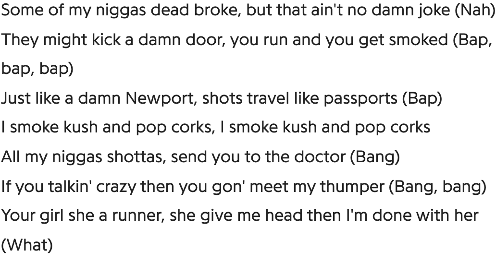
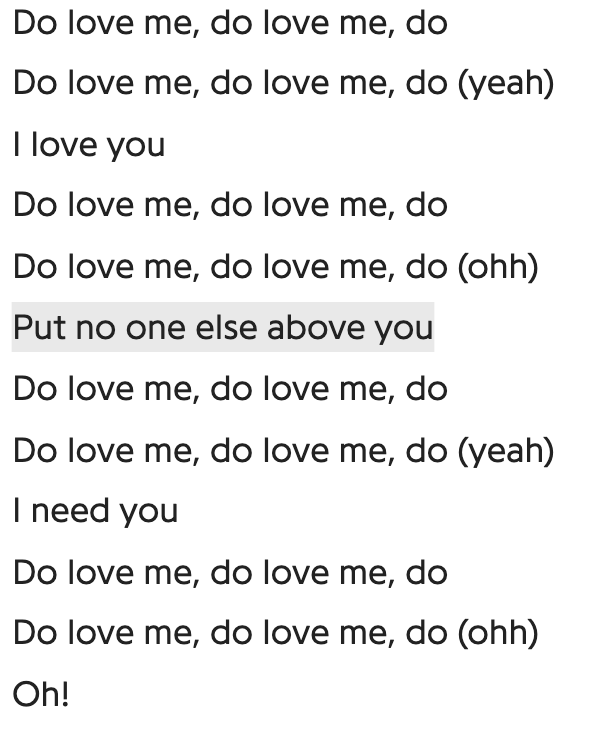
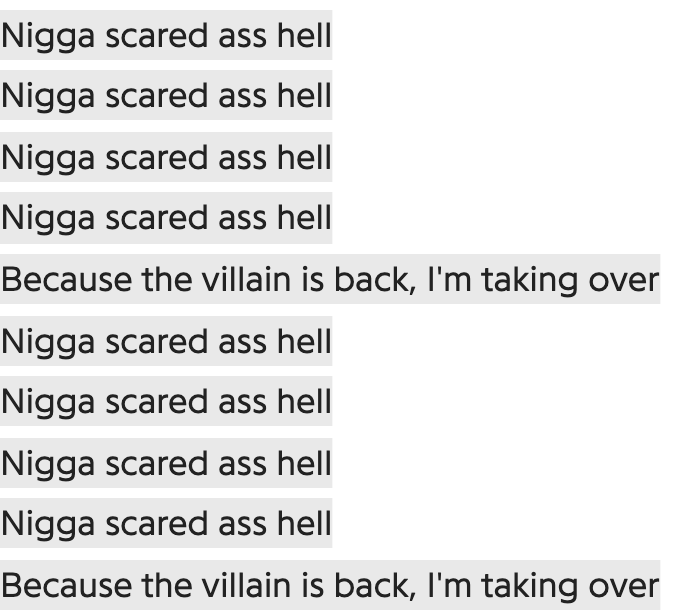

# A-Rappers-Delight
In Depth Lyric Analysis of 211 Rappers and 32,384 different songs, along with 17,407,258 total words

This scrapes the top 250ish rappers on https://www.ranker.com/crowdranked-list/the-greatest-rappers-of-all-time, downloads lyrics to their top songs,
and stores in Json files. We currenly store the data of 211 artists, and a total of 32,384 songs.

I also added in rap groups such as Outkast, NWA, Wu Tang Clan, A Tribe Called Quest, etc because the
website ranked solo rappers only. Though rappers such as Andre 3000, Dr. Dre, RZA, etc were on the list,
I felt it was equally important to include their respective groups

NOTABLE PEOPLE MISSING (DUE TO SCRAPING ISSUES):
 'The Notorious B.I.G.', 'Dr. Dre', 'Chance the Rapper', 'Rakim', 'DMC',

RATING THE VOCABULARY OF SONGS:
    The function get_vocab(x) returns a dict of the number of unique words used within
    the artist's first x words. 
    
 UNIQUE WORDS USED WITHIN AN ARTISTS FIRST 20K WORDS, GROUPED BY GENRE

USE OF CERTAIN KEYWORDS OVERTIME:

The function get_tone() gets the tone of each song and returns the most positive 
    and negative songs, along with their score. To do this, I used AFINN. AFINN is a list of English words rated for valence with an integer between minus five (negative) and plus five (positive). The words have been manually labeled by Finn Årup Nielsen in 2009-2011. 

It's slightly flawed, words like (pardon my french) fuck and bitch are rated at -4 and -5, hard to use in context. Changing them
moves the most negative song around quite a bit. It would be better to use an AI to determine positivity
and negativity, but unfortunately I don't know how to do that yet

If I keep fuck, bitch, and N***** the same (-5):
The most negative song is currently -620 and the song is Dead Broke by Chief Keef:
Here's a snippet:
    
The most positive song is currently 209 and the song is Summertime Magic by Childish Gambino
Here's a snippet:
                           
Clearly, love is bringing up the total

Changing fuck, bitch, N**** to 0, yields:
The most negative song is currently rated at -406 and the song is Renincarnated by MC Ren

Here's a snippet from Reincarnated:        
   

The most positive song is currently rated at 209 and the song is Summertime Magic by Childish Gambino (wow, stays the same)

Here is the ouput yielded by get_vocab(20,000), which can easily be manipulated in CSV format: (WU-TANG reigns supreme, even on their solo stuff)
Artist, Number of Unique Words

GZA , 4873

MF DOOM , 4728

U-God , 4716

Black Thought , 4628

Ghostface Killah , 4563

Wu-Tang Clan , 4360

Pharoahe Monch , 4345

Inspectah Deck , 4249

Royce da 5'9" , 4192

Kool G Rap , 4081

Raekwon , 4007

Immortal Technique , 3998

Cappadonna , 3974

Lupe Fiasco , 3965

Pusha T , 3810

Fugees , 3786

Big Pun , 3778

Nas , 3767

Erick Sermon , 3739

Yasiin Bey , 3654

Cam’ron , 3650

Talib Kweli , 3622

Tech N9ne , 3591

Killer Mike , 3578

Big Daddy Kane , 3564

A Tribe Called Quest , 3563

Ab-Soul , 3542

Eminem , 3524

N.O.R.E. , 3518

Slick Rick , 3499

JAY-Z , 3498

Obie Trice , 3480

KRS-One , 3448

Mac Dre , 3446

Wyclef Jean , 3442

Sir Mix-a-Lot , 3416

The Game , 3409

Ol’ Dirty Bastard , 3406

Xzibit , 3395

Joey Bada$$ , 3367

Proof , 3364

JID , 3338

LL Cool J , 3329

Big L , 3314

Cordae , 3312

A$AP Rocky , 3295

Danny Brown , 3286

Heavy D , 3286

Dave , 3285

Bizarre , 3285

Lloyd Banks , 3263

Guru , 3263

Common , 3254

Ice-T , 3216

Tyler, The Creator , 3207

Method Man , 3205

Q-Tip , 3203

Ice Cube , 3192

Macklemore , 3191

Lil Dicky , 3180

Joe Budden , 3168

Mystikal , 3157

VIC MENSA , 3144

Biz Markie , 3143

Chamillionaire , 3136

Fat Joe , 3135

Bizzy Bone , 3125

Jme , 3119
Lord Finesse , 3113

Kuniva , 3096

Hopsin , 3095

Kurupt , 3083

Will Smith , 3080

B.o.B , 3067

Run–D.M.C. , 3048

BROCKHAMPTON , 3043

Ski Mask the Slump God , 3040

E-40 , 3038

Lil’ Kim , 3035

Busta Rhymes , 3035

Jay Rock , 3028

ScHoolboy Q , 3026

Sheek Louch , 3018

Denzel Curry , 3016

DJ Quik , 3010

Remy Ma , 3004

Public Enemy , 2999

Childish Gambino , 2993

A$AP Ferg , 2991

Kendrick Lamar , 2983

Murs , 2978

The D.O.C. , 2976

Kanye West , 2975

Daz Dillinger , 2969

Layzie Bone , 2966

Big Sean , 2952

Lil Wayne , 2941

Headie One , 2921

Coolio , 2918

B-Real , 2879

Ludacris , 2878

Havoc , 2874

Nicki Minaj , 2865

Kevin Gates , 2853

MC Lyte , 2843

Bun B , 2839

Warren G , 2828

Krayzie Bone , 2819

Styles P , 2813

UGK , 2808

Skepta , 2795

Phife Dawg , 2791

Scarface , 2790

Twista , 2779

Project Pat , 2763

Queen Latifah , 2760

MC Ren , 2759

Machine Gun Kelly , 2758

Stormzy , 2733

Master P , 2731

Vince Staples , 2730

Isaiah Rashad , 2717

Big K.R.I.T. , 2714

Gucci Mane , 2712

Joyner Lucas , 2711

Fabolous , 2702

2 Chainz , 2698

Travis Scott , 2680

Diddy , 2669

Afroman , 2668

G-Eazy , 2641

Meek Mill , 2637

Eve , 2636

Lil Yachty , 2636

Mac Miller , 2629

Anderson .Paak , 2626

T.I. , 2626

Logic , 2624

Aminé , 2622

50 Cent , 2614

Snoop Dogg , 2607

Ace Hood , 2607

Polo G , 2607

XXXTENTACION , 2604

2Pac , 2599

Offset , 2594

Migos , 2587

Gunna , 2585

Eazy-E , 2577

J. Cole , 2558

Young Thug , 2557

Lisa “Left Eye” Lopes , 2541

21 Savage , 2521

NLE Choppa , 2519

Too $hort , 2519

Nelly , 2518

Trick Daddy , 2509

Jeezy , 2506

N.W.A , 2506

Swae Lee , 2499

Young Buck , 2487

Juvenile , 2482

Ma$e , 2481

Grandmaster Flash , 2453

Ja Rule , 2452

Waka Flocka Flame , 2426

Kodak Black , 2419

Future , 2395

Drake , 2383

Iggy Azalea , 2379

Cardi B , 2368

Roddy Ricch , 2340

DMX , 2328

Boosie Badazz , 2321

Juice WRLD , 2316

NF , 2297

Juicy J , 2294

Nate Dogg , 2290

Kid Cudi , 2289

Lil Baby , 2278

Lil Durk , 2252

Lil Tjay , 2200

Trippie Redd , 2192

Lil Jon , 2190

DaBaby , 2184

Flo Rida , 2180

Kid Ink , 2175

Rich The Kid , 2172

MC Hammer , 2159

Ty Dolla $ign , 2148

Doja Cat , 2129

Lil Nas X , 2111

YNW Melly , 2084

Megan Thee Stallion , 2068

Lil Uzi Vert , 2049

YBN Nahmir , 2034

Post Malone , 2026

YoungBoy Never Broke Again , 2025

Takeoff , 2023

A Boogie wit da Hoodie , 2018

T-Pain , 2009

Chief Keef , 1989

Lil Skies , 1982

King Von , 1960

Wiz Khalifa , 1955

Fetty Wap , 1917

Playboi Carti , 1730

Trey Songz , 1702

Lil Tecca , 1682

Doug E. Fresh , 1531

